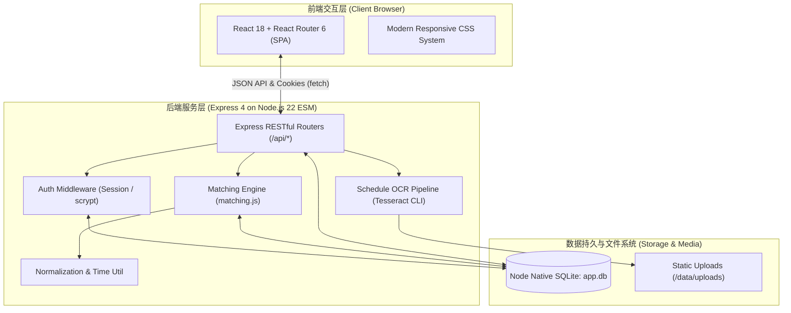
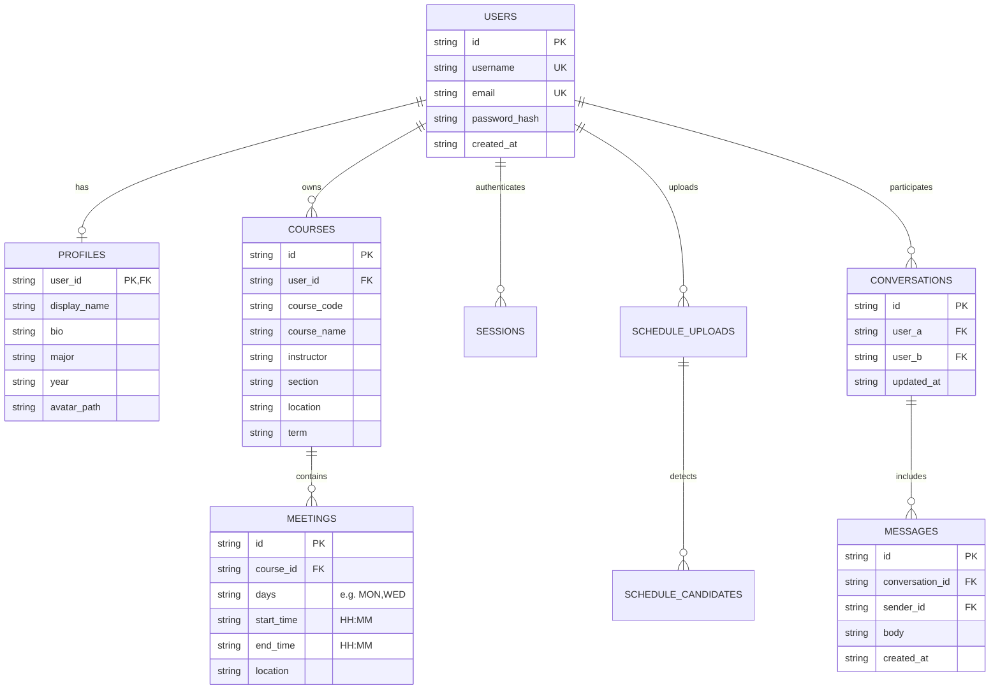

# 📚 Classmate Discovery (UCLA CS 35L Project)

<div align="center">

[-339933?logo=node.js&logoColor=white)](https://nodejs.org/)
[](https://react.dev/)
[](https://vitejs.dev/)
[](https://nodejs.org/api/sqlite.html)
[](https://github.com/tesseract-ocr/tesseract)
[](https://playwright.dev/)
[-brightgreen)](#-测试体系)

**面向大学生的全栈课表社交与同课课友智能匹配平台**  
*A Full-Stack University Course Social & Classmate Matching Web Application*

</div>

---

## 📖 项目简介 (Overview)

在大型综合性大学（如 UCLA），许多核心专业课动辄有数百名学生在同一间阶梯教室上课。然而，由于缺乏便捷的选课沟通渠道，学生们往往面临以下痛点：
- **互不相识**：身边坐着同专业的同学，却缺少一个自然的破冰途径；
- **组队困难**：课程大作业（Course Projects）、实验 Lab、复习小组难以找到志同道合、作息时间匹配的队友；
- **信息孤岛**：即便选了同一个教授的不同课程，或者不同日期的相同时段有空，彼此也毫无交集。

**Classmate Discovery** 是一套现代化的全栈 Web 系统。学生只需录入或上传一张课表截图，系统即可通过 **OCR 智能识别提取** 与 **多维度重叠算法**（课程、授课教授、上课时段交集），毫秒级计算全校同学与你的匹配程度，提供直观的可视化标签说明，并支持即时 1:1 私信沟通，打通课表孤岛！

> 💡 **免部署全景导览**：无需在本地配置环境或启动服务，本 README 提供了**全部页面真实高分辨率截图**、**核心交互流程**、**算法数学模型**与**系统架构图**，助您在几分钟内全方位了解系统的每一个细节！

---

## 📑 目录 (Table of Contents)

1. [✨ 核心功能矩阵](#-核心功能矩阵)
2. [🖼️ 系统页面全景图解 (Visual Tour)](#️-系统页面全景图解-visual-tour)
   - [01. 用户认证与注册 (Auth & Register)](#01-用户认证与安全注册-auth--register)
   - [02. 个人仪表盘 (Dashboard)](#02-个人核心仪表盘-dashboard)
   - [03. 课友智能匹配发现 (Discover - Best Match)](#03-课友智能匹配发现-discover---best-match)
   - [04. 课友高级多维筛选 (Discover - Filter & Sort)](#04-课友高级多维筛选-discover---filter--sort)
   - [05. 我的课程列表管理 (My Courses)](#05-我的课程列表管理-my-courses)
   - [06. 课程手动录入与时段编辑 (Course Edit Modal)](#06-课程手动录入与时段编辑-course-edit-modal)
   - [07. 课表图片 OCR 智能导入入口 (Schedule Upload)](#07-课表图片-ocr-智能导入入口-schedule-upload)
   - [08. OCR 候选识别与人工复核闭环 (OCR Review & Confirm)](#08-ocr-候选识别与人工复核闭环-ocr-review--confirm)
   - [09. 1:1 消息中心收件箱 (Messages Inbox)](#09-11-消息中心收件箱-messages-inbox)
   - [10. 实时私信聊天互动 (1:1 Chatroom)](#10-实时私信聊天互动-11-chatroom)
   - [11. 课友公开资料与课程比对 (Public Profile)](#11-课友公开资料与课程比对-public-profile)
   - [12. 个人资料编辑与头像管理 (My Profile)](#12-个人资料编辑与头像管理-my-profile)
3. [🏗️ 系统架构与技术选型](#️-系统架构与技术选型)
4. [🧠 核心匹配算法与数学原理](#-核心匹配算法与数学原理)
5. [🗄️ 数据库建模设计 (Schema & ER)](#️-数据库建模设计-schema--er)
6. [🔌 RESTful API 接口规范](#-restful-api-接口规范)
7. [🧪 测试体系与自动化验证](#-测试体系与自动化验证)
8. [🚀 快速开始与本地部署指南](#-快速开始与本地部署指南)

---

## ✨ 核心功能矩阵

| 功能模块 | 关键技术 / 亮点说明 | 对应页面 |
| :--- | :--- | :--- |
| **账户体系与安全** | `scrypt` 密码安全加盐散列，HttpOnly + SHA-256 会话隔离，防暴力破解 | 登录、注册 |
| **个人课表管理** | 支持一门课程设置多个上课 Meeting（多星期、多时间段、教室地点），防重复课程检测 | 我的课程 |
| **智能课表识别** | Tesseract OCR 解析课表截图；**拒绝盲从 OCR**：提供完整的人工校验、编辑与差错提示闭环 | 课表上传与复核 |
| **多维度重叠匹配** | 课程代码统一规范化、教授姓名模糊消歧、时间区间交集数学模型、确定性加权总分 | 课友发现、仪表盘 |
| **智能检索与筛选** | 支持按最佳匹配/课程数/教授/上课时间排序；支持同类别 OR、跨类别 AND 复合条件过滤 | 课友发现 |
| **透明化匹配解释** | 不向用户展示晦涩难懂的原始分数，而是渲染清晰的原因 Chip（共享课程、共同教授、重合时间） | 课友发现、公开资料 |
| **1:1 即时私信系统** | 双方会话聚合统一，最新动态消息实时轮询，支持双向一键彻底清空对话记录 | 消息中心、聊天窗口 |
| **隐私保护主页** | 公开资料仅暴露社交与课表对比信息，严格隔离邮箱、密码与私密数据 | 课友公开主页 |

---

## 🖼️ 系统页面全景图解 (Visual Tour)

> 💡 点击图片下方说明可了解对应的业务逻辑与底层实现细节。

---

### 01. 用户认证与安全注册 (Auth & Register)

系统提供简洁高效的双栏认证体系。密码在落库前经过 Node.js 原生 `scrypt` 强哈希加密，杜绝任何明文传输与存储。

<div align="center">
  <p><b>图 1-1：用户登录界面 (Login)</b></p>
  
</div>

<br/>

<div align="center">
  <p><b>图 1-2：新用户注册界面 (Register)</b></p>
  
</div>

- **交互细节**：支持用户名/邮箱双向登录，前端自动拦截非法格式并给出即时友好提示；注册成功后无缝跳转至个人资料完善引导。

---

### 02. 个人核心仪表盘 (Dashboard)

学生登录后的第一站。实时聚合展示当前用户的课表规模与社交网络重叠概览，让同课信息一目了然。

<div align="center">
  <p><b>图 2：学生个人仪表盘 (Dashboard)</b></p>
  
</div>

- **核心数据指标**：
  - **Shared 3+ courses**：深度同课伙伴数量（例如共同选修 CS 35L、CS 111、MATH 131A 的神仙同学）；
  - **Shared 2+ courses**：高重叠度潜在组队伙伴；
  - **Total classmates**：当前学期全校所有存在至少一项交集的同学总数。
- **快捷入口**：提供快速直达课表录入、OCR 智能识别与推荐伙伴私信卡片。

---

### 03. 课友智能匹配发现 (Discover - Best Match)

Classmate Discovery 的核心引擎。系统依据多维度综合打分模型，自适应展示最匹配的同学，每个卡片均清晰展开重合维度与原因。

<div align="center">
  <p><b>图 3：课友发现 - 综合最佳匹配列表 (Best Match)</b></p>
  
</div>

- **设计亮点**：
  - **透明度优先**：抛弃抽象的冰冷分数值，采用高亮标签（Tag Chips）明确标注“3 shared courses”、“1 shared instructor”、“6h time overlap”；
  - **同课高亮展示**：卡片内部直观陈列具体的相同课程名称（如 `CS 35L`、`CS 111`），点击同学即可进入公开主页或直接发私信。

---

### 04. 课友高级多维筛选 (Discover - Filter & Sort)

面对庞大的学生群体，提供精准的过滤机制，帮助学生按照目标需求找到特定人群。

<div align="center">
  <p><b>图 4：按课程关键词进行精确筛选 (Filtering by Course)</b></p>
  
</div>

- **筛选维度支持**：
  - **排序模式**：Best Match（综合最佳）、Shared Courses（共享课程最多）、Shared Instructor（同位教授优先）、Time Overlap（空余时间最接近）；
  - **课程代码/名称**：支持输入课程前缀、模糊名称或别名（如 `CS 35L` 或 `COM SCI 35L` 均能精准命中）；
  - **授课教师**：快速定位同一位导师名下的所有学生；
  - **星期与上课时间**：支持勾选特定星期（Mon/Tue...）以及精确到小时的时间段检索。

---

### 05. 我的课程列表管理 (My Courses)

展示当前用户已录入的所有课程，包含详细的课程编号、课程名、教授、上课周次、时段以及教室地点。

<div align="center">
  <p><b>图 5：我的课程列表 (My Courses View)</b></p>
  
</div>

- **功能亮点**：
  - 支持单门课程关联多个上课会议时段（例如 Lecture + Discussion + Lab）；
  - 单独卡片操作：随时支持原地修改（Edit）或删除（Delete）。

---

### 06. 课程手动录入与时段编辑 (Course Edit Modal)

点击 “Add Course” 或编辑已有课程时弹出的多功能对话框。

<div align="center">
  <p><b>图 6：课程录入与时段编辑弹窗 (Course Form Modal)</b></p>
  
</div>

- **交互体验**：
  - **可视化星期选择器**：支持一键切换 Mon/Tue/Wed/Thu/Fri 标签；
  - **动态增减会议**：点击 “+ Add another meeting” 支持为同一门课程配置不同日期的讨论课（Discussion）；
  - **防撞校验**：后端内置时间有效性与重合查重逻辑，避免用户误输入重复或倒置的时段（如结束时间早于开始时间）。

---

### 07. 课表图片 OCR 智能导入入口 (Schedule Upload)

免去逐字敲入课表的繁琐，支持直接上传学校教务系统（MyUCLA, Canvas, iCal截图等）的课表截图。

<div align="center">
  <p><b>图 7：课表图片拖拽上传界面 (Schedule Upload Landing)</b></p>
  
</div>

- **规格与特性**：
  - 支持 JPG、PNG、WebP 等格式（最大 10MB）；
  - 支持鼠标拖拽（Drag & Drop）与本地文件选择，选定后可立即进行本地图片实时预览。

---

### 08. OCR 候选识别与人工复核闭环 (OCR Review & Confirm)

> ⚠️ **设计哲学：人机协同防错机制 (Human-in-the-Loop)**  
> OCR 图像识别由于截图清晰度、排版差异必然存在识别误差。本系统**坚决不将 OCR 结果自动落库**，而是将其转换为交互式待审候选表单，由学生确认后再保存。

<div align="center">
  <p><b>图 8：OCR 课表识别候选审查与修正界面 (Review Candidates)</b></p>
  
</div>

- **审查亮点**：
  - **置信度预警**：当图片模糊或布局非标准时，顶部展示黄色 Warning Banner；
  - **行内就地修改**：OCR 识别出的课程代码、名称、教授、星期按钮、起止时间均可在当前表单内直接修改；
  - **挑选保存**：每行提供复选框，可自由取消误识别的非课程行；
  - **自动跳过重复**：即便候选列表中包含用户已有的课程，后端入库时也会自动去重跳过，绝不产生脏数据。

---

### 09. 1:1 消息中心收件箱 (Messages Inbox)

内置专属于选课学生的私信沟通中心，展示与所有同学的最近对话动态。

<div align="center">
  <p><b>图 9：消息会话列表收件箱 (Messages Inbox)</b></p>
  
</div>

- **架构特性**：
  - 任意两位同学之间保持**唯一权威对话会话（Canonical Conversation）**；
  - 按照最新交流时间倒序排列，展示对方姓名、头像以及最新一条消息摘要。

---

### 10. 实时私信聊天互动 (1:1 Chatroom)

与课友快速约定自习时间、交流作业思路或确认课程项目的聊天室界面。

<div align="center">
  <p><b>图 10：1对1 实时消息聊天室 (1:1 Chat Room)</b></p>
  
</div>

- **交互体验**：
  - 消息气泡区分发送方与接收方，带精确发送时间戳；
  - 界面支持自动平滑滚动到底部，轮询机制保证最新回复准实时抵达；
  - 顶部配备全量会话删除功能（Delete Conversation），一键清除双方会话，保障个人隐私。

---

### 11. 课友公开资料与课程比对 (Public Profile)

点击任意课友卡片即可进入其公开个人主页。此页面不仅是名片，更是一张**两人课表交集对比图**。

<div align="center">
  <p><b>图 11：课友公开资料与课表交集对比 (Public Profile View)</b></p>
  
</div>

- **比对展示**：
  - **Shared courses**：逐一高亮两个人共同选修的课程与教授（例如共同修读 Paul R. Eggert 教授的 CS 35L）；
  - **Shared class times**：逐一列出同时在上课的时段对比，方便约在课前或课后碰头；
  - **安全隐私隔离**：公开接口过滤掉对方的电子邮箱、密码散列和私有敏感信息。

---

### 12. 个人资料编辑与头像管理 (My Profile)

方便学生自定义个人对外展示形象与学术背景。

<div align="center">
  <p><b>图 12：个人主页与资料编辑界面 (My Profile Editing)</b></p>
  
</div>

- **配置项**：
  - 姓名/昵称（Display Name）
  - 专业（Major）与 年级（Year: 1st ~ 4th Year / Graduate）
  - 个人简介（Bio）：描述你的学术兴趣或组队诉求
  - 个人头像上传（Avatar Upload）：支持即时裁剪预览与静态文件托管服务。

---

## 🏗️ 系统架构与技术选型

本项目采用高内聚、低耦合的模块化设计，技术栈轻量且前沿，**零庞大臃肿框架包袱**，启动极快。



### 技术栈选型亮点

1. **Node.js 22 + 原生 `node:sqlite`**：
   - 摆脱了传统 `node-gyp` 笨重原生 C++ 扩展编译依赖，直接利用 Node.js 22 官方内置的 SQLite 驱动，跨平台一致性高，零额外驱动依赖。
2. **React 18 + Vite 6**：
   - 超快毫秒级构建与热重载，生成轻巧优化的单页应用静态产物（SPA Bundle gzip < 70KB）。
3. **安全认证体系**：
   - 选用标准 `crypto.scrypt` 密码加盐散列算法；
   - 会话 Cookie 统一标记 `HttpOnly` 与 `SameSite=Lax`，服务器端存储 `SHA-256` 会话 Token 摘要，防客户端 XSS 盗取。
4. **Tesseract OCR 插件化设计**：
   - 提取逻辑抽离为 `parseScheduleImage()` 独立接口，支持随时平滑替换为云端 AI 大模型视觉提取接口或本地其他 OCR 引擎。

---

## 🧠 核心匹配算法与数学原理

系统的匹配算法由 `src/matching.js`、`src/courseutil.js`、`src/timeutil.js` 构成，并在单元测试中覆盖了边界条件。

### 1. 课程代码标准化规范 (Course Code Normalization)
学生输入的课程代码往往千奇百怪。算法通过前缀别名库与正则重构，消除拼写和标点差异：
$$\text{normalizeCourse}("COM\ SCI\ 35L") \equiv \text{normalizeCourse}("CS\ 35L") \equiv \text{normalizeCourse}("cs35l") \longrightarrow \mathbf{"CS35L"}$$
同时兼容本科/研究生合并编号（如 `CS C130`、`M51A`）。

### 2. 授课教师姓名模糊消歧 (Instructor Disambiguation)
针对教务系统常见的西方人名倒置格式（`姓, 名`）与缩写（`名 中间首字母. 姓`）：
$$\text{Eggert, Paul} \equiv \text{Paul R. Eggert} \equiv \text{paul eggert} \longrightarrow \mathbf{"eggert,\ paul"}$$
严格比对主要 Token 与词序，有效避免单纯基于姓氏导致同姓（如 Smith / Patel）的误判。

### 3. 时间区间相交数学模型 (Interval Overlap Math)
传统字符串匹配无法计算课表时间重合。本系统将时间转化为当日自午夜起算的分钟数 $[start, end)$，若两会议的星期集合存在交集，则重叠分钟数为：
$$\text{OverlapMinutes} = \max\Big(0,\; \min(end_A, end_B) - \max(start_A, start_B)\Big)$$
不仅能识别完全重合的时段，还能精确识别部分交叠时段（如 13:00~14:50 与 14:00~15:50 存在 50 分钟有效重合）。

### 4. 综合匹配加权评分模型 (Composite Score Formula)
系统结合离散交集与连续度量，计算综合匹配分：
$$S_{\text{total}} = w_c \cdot N_{\text{course}} + w_i \cdot N_{\text{ins}} + w_t \cdot N_{\text{time}} + w_{tm} \cdot \frac{M_{\text{overlap}}}{60} + w_{cr} \cdot R_{\text{course}} + w_{tr} \cdot R_{\text{time}}$$
其中：
- $N_{\text{course}}$：相同课程数量（权重最高）
- $N_{\text{ins}}$：相同授课教师数量
- $N_{\text{time}}$：时间重合会议数量
- $M_{\text{overlap}}$：总重合上课时长（以小时计）
- $R_{\text{course}}$：课程 Jaccard 相似度 $\frac{|A \cap B|}{|A \cup B|}$
- $R_{\text{time}}$：时间区间交并比

针对不同使用场景，系统提供 4 种确定性排序策略：
1. **Best Match**：综合加权总分优先（同课越多、重叠越高越靠前）；
2. **Shared Courses**：共同课程数从高到低绝对排序（3门 > 2门 > 1门）；
3. **Shared Instructor**：同教授优先，帮助学生寻找同风格教授的学习伙伴；
4. **Time Overlap**：重合空余时段优先，方便约图书馆同自习。

---

## 🗄️ 数据库建模设计 (Schema & ER)

数据库采用关系型结构，具备严格的外键约束（`ON DELETE CASCADE`），确保用户删除自身账户时，关联的课程、会议、对话和上传记录完整级联清理。



---

## 🔌 RESTful API 接口规范

| 领域 | 方法 | 路径 | 鉴权 | 说明 |
| :--- | :--- | :--- | :---: | :--- |
| **Auth** | `POST` | `/api/auth/register` | 否 | 注册新用户并自动分配 Session Cookie |
| | `POST` | `/api/auth/login` | 否 | 用户名/邮箱密码校验登录 |
| | `POST` | `/api/auth/logout` | 是 | 销毁服务端 Session 并清空 Cookie |
| **Profile** | `GET` | `/api/me` | 是 | 获取当前登录用户画像、选课数等统计 |
| | `PATCH`| `/api/me` | 是 | 修改当前用户资料（昵称、年级、专业、简介） |
| | `POST` | `/api/me/avatar` | 是 | 上传并裁剪保存用户个人头像 |
| | `GET` | `/api/users/:id` | 是 | 获取指定课友公开资料（含双人课表重合比对） |
| **Courses** | `GET` | `/api/courses` | 是 | 获取当前用户的所有课程与时段 |
| | `POST` | `/api/courses` | 是 | 手动新增一门课程及其 Meetings 时段 |
| | `PATCH`| `/api/courses/:id` | 是 | 修改课程信息并全量替换其 Meetings 时段 |
| | `DELETE`| `/api/courses/:id` | 是 | 删除指定课程及关联 Meetings |
| **Discover**| `GET` | `/api/discover` | 是 | 课友匹配发现接口（支持 `sort`, `course`, `instructor`, `day`, `time` 参数） |
| | `GET` | `/api/dashboard` | 是 | 仪表盘统计摘要（3+同课数、2+同课数、推荐课友） |
| **Schedule**| `POST` | `/api/schedule/upload` | 是 | 上传课表截图并启动 Tesseract OCR 提取候选 |
| | `POST` | `/api/schedule/confirm`| 是 | 确认并批量保存用户复核后的候选课程 |
| **Messages**| `GET` | `/api/messages` | 是 | 获取当前用户的对话收件箱列表（含未读与最新一条） |
| | `GET` | `/api/messages/:userId` | 是 | 获取与指定用户的全部历史聊天记录 |
| | `POST` | `/api/messages` | 是 | 发送 1:1 私信消息（入参 `{ to, body }`） |
| | `DELETE`| `/api/messages/:userId` | 是 | 彻底删除与指定用户的整个双向会话 |

---

## 🧪 测试体系与自动化验证

项目拥有一套坚实的测试保障网，覆盖底层算法、RESTful 接口直至浏览器端到端行为：

```bash
# 运行全部 93 个单元测试与集成测试
npm test

# 单独运行算法与工具函数单元测试
npm run test:unit

# 单独运行 API 与路由集成测试（基于内存数据库与临时端口）
npm run test:integration

# 运行 Playwright 浏览器完整 20 步用户端到端真实操作仿真
npm run test:e2e
```

### 测试执行结果实录
```text
✔ register creates user, profile and a session cookie (266ms)
✔ duplicate username or email is rejected (61ms)
✔ course overlap normalizes notation variants (1ms)
✔ instructor overlap handles variants and counts distinct persons (1ms)
✔ time overlap: exact, partial, none, different day (5ms)
✔ upload -> OCR candidates -> review -> confirm saves structured courses (380ms)
✔ real UCLA iCal calendar screenshot parses into plausible candidates (719ms)
✔ rankCandidates: best match combines dimensions; more shared courses wins (1ms)
✔ two users can exchange messages in both directions (107ms)
✔ DELETE removes the whole conversation for both users (94ms)
--------------------------------------------------------------------------------
ℹ tests 93  |  suites 0  |  pass 93  |  fail 0  |  cancelled 0  |  duration 1.59s
```

---

## 🚀 快速开始与本地部署指南

### 环境要求
- **Node.js** ≥ 22.5.0（使用原生内置 `node:sqlite` 模块）
- **Tesseract OCR**（可选，用于本地课表识别功能：`sudo apt install tesseract-ocr` 或 `brew install tesseract`）
- **Chromium**（可选，仅用于端到端自动化测试：`npx playwright install chromium`）

### 三步安装与运行

```bash
# 1. 克隆本仓库并安装依赖
git clone https://github.com/wjxssb/CS35.git
cd CS35
npm install

# 2. 构建前端静态资源并填充预置演示数据
npm run build
npm run seed

# 3. 启动服务
npm start
```

访问 `http://localhost:3000` 即可开始体验！

### 内置预置演示账号 (Demo Accounts)
`npm run seed` 命令内置了 10 位不同专业、精心设计了不同课表重叠度的 UCLA 同学账号。  
所有演示账号统一初始密码为：**`demo1234`**

| 用户名 | 姓名 (Display Name) | 专业 (Major) | 典型课程与重叠设计 |
| :--- | :--- | :--- | :--- |
| **`frank`** | Frank Zhang | Computer Science | 核心主角账号（修读 CS 35L, CS 111, MATH 131A） |
| **`dave`** | Dave Osei | Computer Science | **3 门课程完全重合**（CS 35L, CS 111, MATH 131A） |
| **`carol`**| Carol Kim | Computer Science | **2 门课程重合**（CS 35L, CS 111） |
| **`bob`**  | Bob Martinez | Computer Science | **1 门课程重合**（CS 35L 相同教室相同时间） |
| **`ivy`**  | Ivan Petrov | Electrical Eng | 选了 6 门课，与 Frank 存在多段复杂重合与部分时段交叉 |
| **`henry`**| Henry Costa | Computer Science | 格式差异测试账号（课表写为 `COM SCI 35L`，教授写为 `Eggert, Paul`） |
| **`erin`** | Erin Walsh | Electrical Eng | 同教授不同课程（选修 Eggert 的 CS 31） |
| **`felix`**| Felix Braun | Chemistry | 同时间同教室不同课程（化学课与 35L 在同一下午同一大厅） |
| **`alice`**| Alice Nguyen | Art History | 文理交叉对照组（无重叠基准） |
| **`grace`**| Grace Adeyemi| Psychology | 心理学交叉对照组 |

---

<div align="center">
  <sub>UCLA CS 35L Software Construction Project · Crafted with ❤️ by Frank & wjxssb</sub>
</div>
