# 📚 Classmate Discovery (UCLA CS 35L Project)

<div align="center">

[-339933?logo=node.js&logoColor=white)](https://nodejs.org/)
[](https://react.dev/)
[](https://vitejs.dev/)
[](https://nodejs.org/api/sqlite.html)
[](https://github.com/tesseract-ocr/tesseract)
[](https://playwright.dev/)
[-brightgreen)](#testing-and-automated-validation)

**A full-stack platform for university schedules, classmate discovery, and course-based matching**<br/>
*Find classmates, compare schedules, and connect through direct messages.*

</div>

---

<a id="overview"></a>
## 📖 Overview

At large universities such as UCLA, hundreds of students may attend the same core course in a lecture hall. Without an easy way to connect around their schedules, students often face several challenges:

- **Meeting classmates:** Students may sit beside others in the same major without a natural way to start a conversation.
- **Finding teammates:** Course projects, labs, and study groups require partners with compatible interests and schedules.
- **Connecting across courses:** Students who share an instructor or overlapping class times may never discover those connections.

**Classmate Discovery** is a modern full-stack web application. Students can enter courses manually or upload a schedule screenshot. **OCR extraction** and a **multidimensional matching algorithm** compare course codes, instructors, and class meeting times to identify relevant classmates. Clear labels explain each match, and 1:1 direct messaging helps students connect.

> 💡 **Explore without setting up the application:** This README includes **high-resolution screenshots of every page**, **key interaction flows**, **mathematical models for matching**, and **system architecture diagrams**, so you can understand the application before running it locally.

---

## 📑 Table of Contents

1. [✨ Feature Matrix](#feature-matrix)
2. [🖼️ Visual Tour](#visual-tour)
   - [01. Authentication and Registration](#01-authentication-and-registration)
   - [02. Dashboard](#02-dashboard)
   - [03. Discover: Best Match](#03-discover-best-match)
   - [04. Discover: Filtering and Sorting](#04-discover-filtering-and-sorting)
   - [05. My Courses](#05-my-courses)
   - [06. Manual Course Entry and Meeting Editor](#06-manual-course-entry-and-meeting-editor)
   - [07. Schedule Screenshot Upload](#07-schedule-screenshot-upload)
   - [08. OCR Review and Confirmation](#08-ocr-review-and-confirmation)
   - [09. Messages Inbox](#09-messages-inbox)
   - [10. Direct Messaging](#10-direct-messaging)
   - [11. Public Profiles and Course Comparisons](#11-public-profiles-and-course-comparisons)
   - [12. Profile Editing and Avatars](#12-profile-editing-and-avatars)
3. [🏗️ Architecture and Technology Stack](#architecture-and-technology-stack)
4. [🧠 Matching Algorithms and Mathematical Models](#matching-algorithms-and-mathematical-models)
5. [🗄️ Database Schema and Relationships](#database-schema-and-relationships)
6. [🔌 RESTful API Reference](#restful-api-reference)
7. [🧪 Testing and Automated Validation](#testing-and-automated-validation)
8. [🚀 Quick Start and Local Setup](#quick-start-and-local-setup)

---

<a id="feature-matrix"></a>
## ✨ Feature Matrix

| Feature | Technology and Highlights | Pages |
| :--- | :--- | :--- |
| **Accounts and authentication** | Salted `scrypt` password hashes, HttpOnly session cookies, and SHA-256 session token hashes stored on the server | Login, Register |
| **Personal course schedules** | Multiple meetings per course, with separate weekdays, time ranges, and locations; duplicate course detection | My Courses |
| **Schedule recognition** | Tesseract OCR extracts courses from screenshots; users review, edit, and confirm results before saving | Schedule Upload and Review |
| **Multidimensional matching** | Course code normalization, instructor name disambiguation, interval overlap calculations, and deterministic weighted scoring | Discover, Dashboard |
| **Search and filtering** | Sort by best match, shared courses, shared instructors, or overlapping class times; combine OR within filter categories and AND across categories | Discover |
| **Explainable matches** | Clear chips show shared courses, shared instructors, and overlapping class meetings instead of exposing raw scores | Discover, Public Profile |
| **1:1 direct messaging** | One shared conversation per pair of users, polling for new messages, and deletion of the entire conversation for both participants | Messages, Chat |
| **Public profile privacy** | Public profiles expose social and course comparison information while keeping email addresses, password hashes, and session data private | Public Profile |

---

<a id="visual-tour"></a>
## 🖼️ Visual Tour

> 💡 The notes below each screenshot explain the associated interaction and implementation details.

---

### 01. Authentication and Registration

The application provides a centered, single-column authentication form. Passwords are salted and hashed with Node.js's native `scrypt` before being stored in the database.

<div align="center">
  <p><b>Figure 1-1: Login page</b></p>
  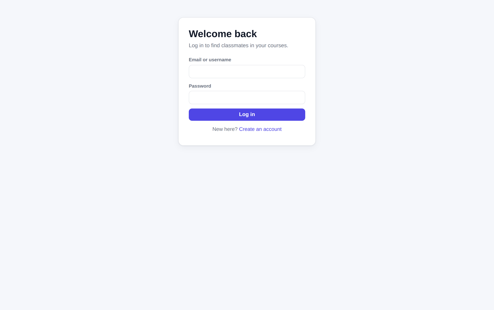
</div>

<br/>

<div align="center">
  <p><b>Figure 1-2: Registration page</b></p>
  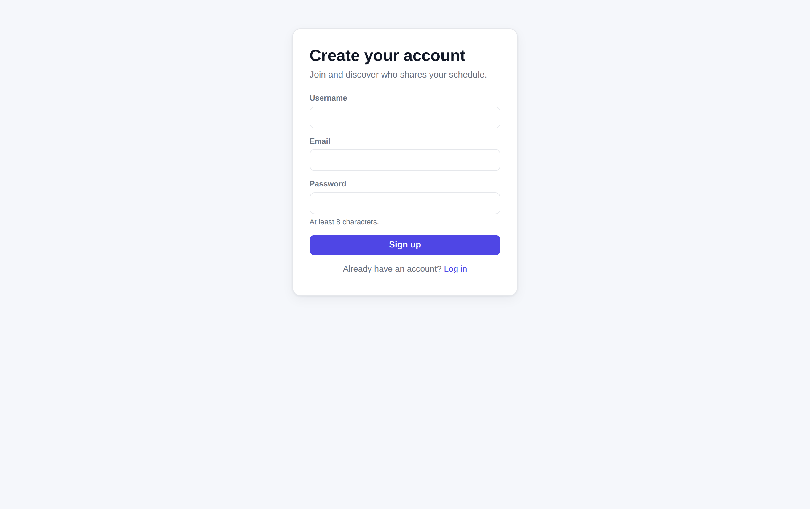
</div>

- **Interaction details:** Users can log in with either a username or an email address. Input validation provides clear feedback, and successful registration takes the user to their profile to complete their details.

---

### 02. Dashboard

The dashboard is the first stop after login. It summarizes the user's courses and connections with other classmates.

<div align="center">
  <p><b>Figure 2: Personal dashboard</b></p>
  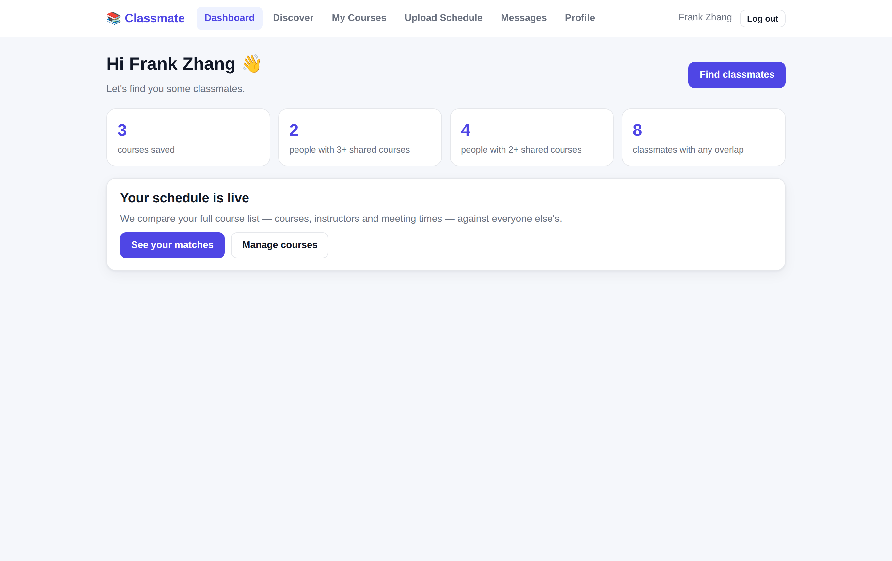
</div>

- **Key metrics:**
  - **Shared 3+ courses:** Classmates who share at least three courses, such as CS 35L, CS 111, and MATH 131A.
  - **Shared 2+ courses:** Classmates with at least two courses in common, who may be good potential teammates.
  - **Total classmates:** Users with at least one matching dimension: a course, an instructor, or overlapping class times.
- **Quick access:** Links lead to Discover and course management. Users with no courses can choose manual course entry or OCR schedule upload.

---

### 03. Discover: Best Match

Discover is the core of Classmate Discovery. A weighted model ranks classmates across several dimensions, and each card explains why the person matches.

<div align="center">
  <p><b>Figure 3: Classmates ranked by best match</b></p>
  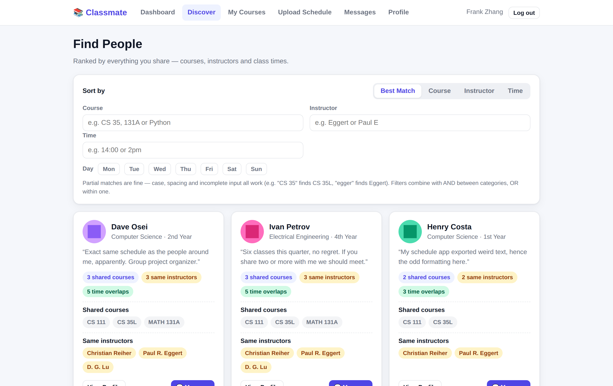
</div>

- **Design highlights:**
  - **Clear explanations:** Highlighted chips show the number of shared courses, shared instructors, and overlapping class meetings.
  - **Shared course labels:** Cards list courses in common, such as `CS 35L` and `CS 111`. Users can open a classmate's public profile or send a direct message.

---

### 04. Discover: Filtering and Sorting

Filters help students find relevant classmates within a larger student community.

<div align="center">
  <p><b>Figure 4: Discover filtering controls</b></p>
  
</div>

- **Available filters and sorting options:**
  - **Sort mode:** Best Match, Shared Courses, Shared Instructor, and Time Overlap.
  - **Course code or name:** Search using prefixes, partial names, and supported aliases. For example, `CS 35L` and `COM SCI 35L` match the same course.
  - **Instructor:** Find students taking courses with a particular instructor.
  - **Weekday and class time:** Select specific days, such as Mon or Tue, and class times to narrow the results.

---

### 05. My Courses

This page lists all courses entered by the current user, including course codes, names, instructors, meeting days, times, and locations.

<div align="center">
  <p><b>Figure 5: My Courses list</b></p>
  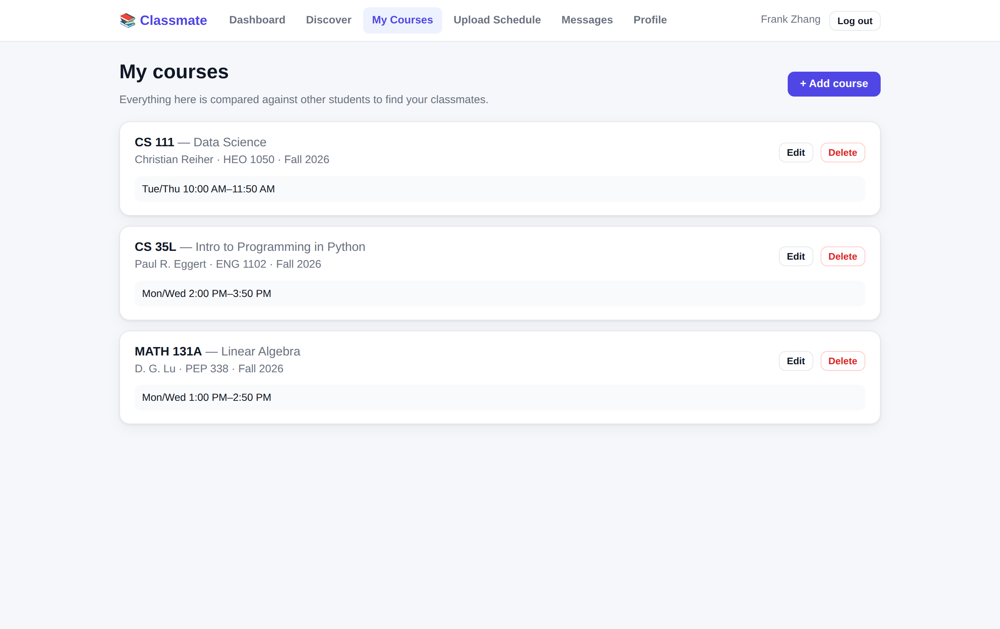
</div>

- **Feature highlights:**
  - A course can contain multiple meetings, such as a lecture, discussion, and lab.
  - Each course card provides Edit and Delete actions.

---

### 06. Manual Course Entry and Meeting Editor

Selecting "Add course" or editing an existing course opens an inline form for course details and meeting times.

<div align="center">
  <p><b>Figure 6: Course entry and meeting editor</b></p>
  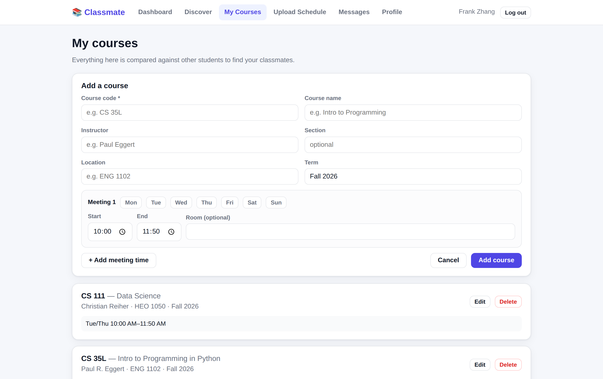
</div>

- **Interaction details:**
  - **Weekday selector:** Toggle day buttons to specify when each meeting takes place.
  - **Multiple meetings:** Use "+ Add meeting time" to add another lecture, discussion, or lab with its own days, times, and room.
  - **Validation:** The backend validates weekdays and time formats, rejects equal start and end times, and detects duplicate courses with matching meeting windows. An end time before the start time is treated as an overnight meeting.

---

### 07. Schedule Screenshot Upload

Students can upload screenshots from systems such as MyUCLA, Canvas, or an iCal calendar instead of entering every course manually.

<div align="center">
  <p><b>Figure 7: Schedule screenshot upload</b></p>
  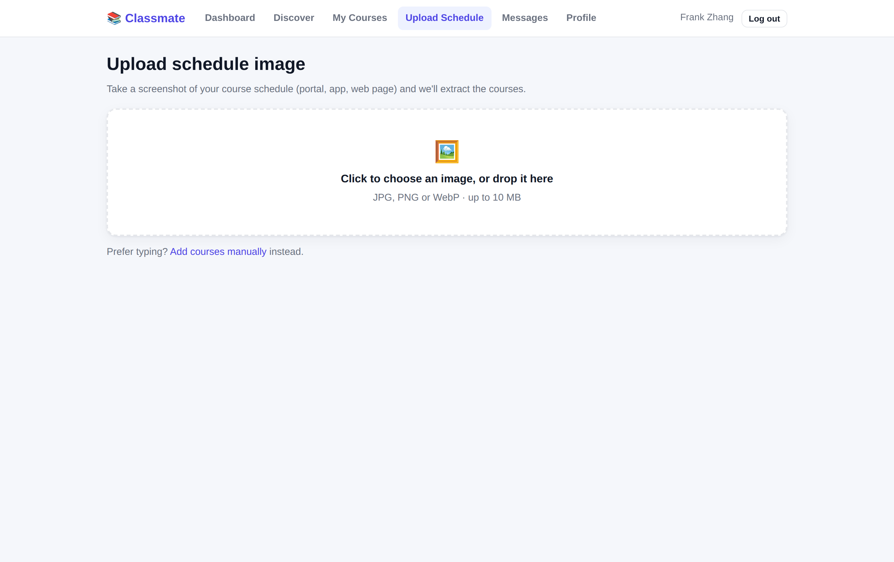
</div>

- **Supported formats and interactions:**
  - JPG, PNG, and WebP images, up to 10 MB.
  - Drag and drop or select a local file, then preview the image before uploading.

---

### 08. OCR Review and Confirmation

> ⚠️ **Design principle: Human-in-the-loop review**<br/>
> Screenshot quality and layout differences can cause OCR errors. The application converts OCR output into editable course candidates and saves them only after the student reviews and confirms them.

<div align="center">
  <p><b>Figure 8: Reviewing and correcting OCR course candidates</b></p>
  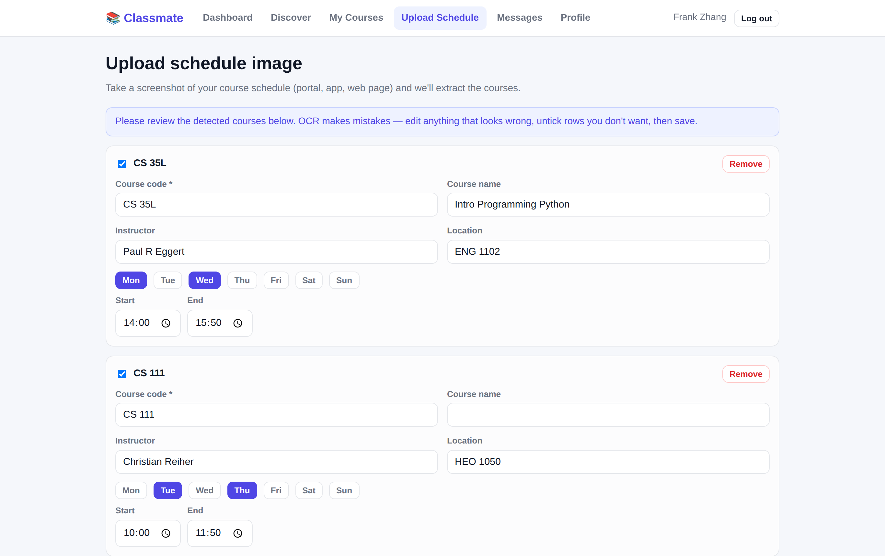
</div>

- **Review features:**
  - **Warnings:** A yellow warning banner highlights extraction issues or results that need closer review.
  - **Inline editing:** Edit course codes, names, instructors, weekdays, and start and end times directly in the review form.
  - **Selective saving:** Deselect rows that were incorrectly recognized as courses.
  - **Duplicate handling:** The backend skips duplicate courses during confirmation and reports what was saved or skipped.

---

### 09. Messages Inbox

The inbox lists recent conversations with classmates.

<div align="center">
  <p><b>Figure 9: Messages inbox</b></p>
  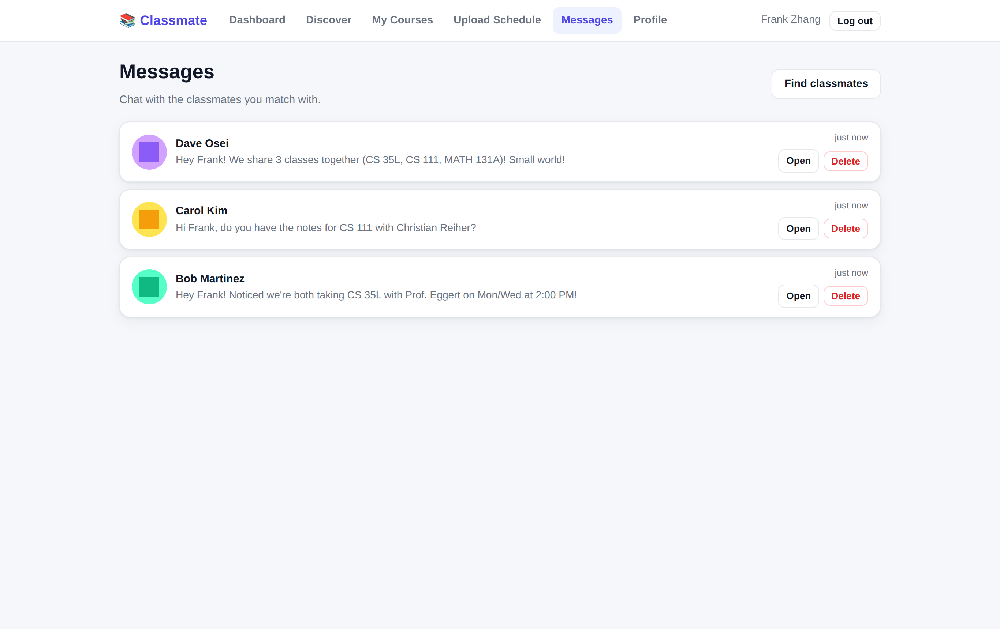
</div>

- **Conversation design:**
  - Each pair of users shares **one canonical conversation**.
  - Conversations appear in order of most recent activity, with the classmate's name, avatar, and latest message preview.

---

### 10. Direct Messaging

The chat page lets classmates arrange study sessions, discuss assignments, and coordinate course projects.

<div align="center">
  <p><b>Figure 10: 1:1 chat</b></p>
  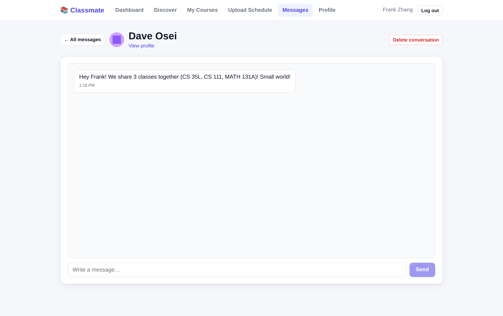
</div>

- **Interaction details:**
  - Message bubbles distinguish sent and received messages and display timestamps.
  - The interface scrolls smoothly to the newest message, and polling retrieves new replies.
  - "Delete conversation" removes the entire conversation and its messages for both participants.

---

### 11. Public Profiles and Course Comparisons

Opening a classmate's profile shows their public information, courses, and a summary of how their schedule overlaps with yours.

<div align="center">
  <p><b>Figure 11: Public profile and course overlap summary</b></p>
  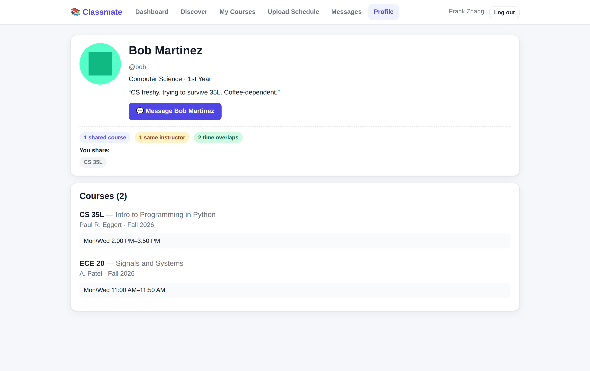
</div>

- **Comparison details:**
  - **Shared courses:** Chips identify courses you both take, such as CS 35L with Paul R. Eggert. The course list includes instructor information.
  - **Overlap summary:** Chips show shared course, shared instructor, and overlapping meeting counts. The classmate's course list shows meeting days, times, and locations.
  - **Privacy:** The public API excludes email addresses, password hashes, and private session data.

---

### 12. Profile Editing and Avatars

Students can customize their public identity and academic background.

<div align="center">
  <p><b>Figure 12: Profile editing</b></p>
  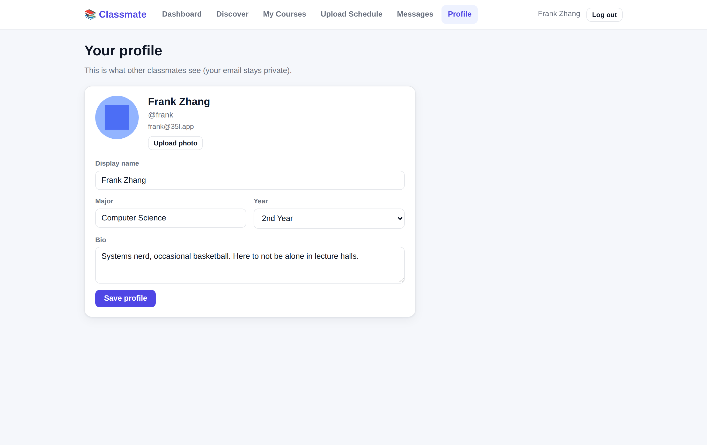
</div>

- **Profile fields:**
  - Display name or nickname.
  - Major and year: 1st through 5th Year, or Graduate.
  - Bio: Describe your academic interests or what you are looking for in a team.
  - Avatar: Upload a JPG, PNG, or WebP image. The updated avatar is displayed in the profile and served as a static file.

---

<a id="architecture-and-technology-stack"></a>
## 🏗️ Architecture and Technology Stack

The application uses a modular architecture with separate frontend, API, matching, OCR, and storage components. Its lightweight technology stack keeps local setup straightforward.

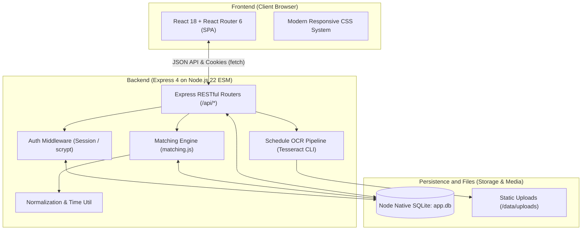

### Technology Highlights

1. **Node.js 22 and native `node:sqlite`:**
   - The built-in SQLite module avoids a separate database driver and the `node-gyp` compilation typically required by native third-party drivers.
2. **React 18 and Vite 6:**
   - Fast development builds and hot module replacement, with an optimized static bundle for the single-page application. The frontend JavaScript bundle is under 70 kB when gzipped.
3. **Authentication:**
   - Passwords use the standard `crypto.scrypt` algorithm with a random salt.
   - Session cookies use `HttpOnly` and `SameSite=Lax`. The server stores SHA-256 hashes of session tokens, and `HttpOnly` prevents client-side JavaScript from reading the cookie.
4. **Modular Tesseract OCR integration:**
   - The extraction logic is exposed through the independent `parseScheduleImage()` interface, providing a clear boundary for replacing the OCR engine or adding a cloud-based vision service.

---

<a id="matching-algorithms-and-mathematical-models"></a>
## 🧠 Matching Algorithms and Mathematical Models

Matching is implemented in `src/matching.js`, `src/courseutil.js`, and `src/timeutil.js`. Unit tests cover normalization and overlap edge cases.

### 1. Course Code Normalization

Students may enter the same course code in different formats. Prefix aliases and regular expressions normalize supported spacing, case, and notation variants:

$$\text{normalizeCourse}("COM\ SCI\ 35L") \equiv \text{normalizeCourse}("CS\ 35L") \equiv \text{normalizeCourse}("cs35l") \longrightarrow \mathbf{"cs35l"}$$

The parser also supports course numbering variants such as `CS C130` and `M51A`.

### 2. Instructor Name Disambiguation

Instructor matching handles surname-first formats (`last name, first name`), punctuation, and middle initials (`first name middle initial. last name`). For example, normalization produces:

$$\text{normalizeInstructor}("Eggert,\ Paul") = \text{normalizeInstructor}("paul\ eggert") = \mathbf{"paul\ eggert"}$$

$$\text{normalizeInstructor}("Paul\ R.\ Eggert") = \mathbf{"paul\ r\ eggert"}$$

The comparison function then recognizes compatible middle-initial variants as the same person:

$$\text{instructorsMatch}("Eggert,\ Paul",\; "Paul\ R.\ Eggert") = \text{true}$$

Name matching compares the relevant name tokens without relying on a shared surname alone. This helps distinguish different people with common surnames such as Smith or Patel.

### 3. Interval Overlap

String equality cannot measure partially overlapping class times. The application converts each time to minutes since midnight and represents a meeting as a half-open interval $[start, end)$. For a shared weekday, the overlap is:

$$\text{OverlapMinutes} = \max\Big(0,\; \min(end_A, end_B) - \max(start_A, start_B)\Big)$$

This detects both identical and partially overlapping intervals. For example, 13:00–14:50 and 14:00–15:50 overlap by 50 minutes. The meeting comparison sums overlap across shared weekdays and supports overnight meeting intervals.

### 4. Composite Match Score

The implementation combines counts, overlap ratios, and total overlapping class minutes:

$$S_{\text{total}} = 5\big(N_{\text{course}} + R_{\text{course}}\big) + 3\big(N_{\text{ins}} + R_{\text{ins}}\big) + 2\big(N_{\text{time}} + R_{\text{time}}\big) + \frac{M_{\text{overlap}}}{100}$$

Where:

- $N_{\text{course}}$: Number of distinct shared courses; this dimension has the highest weight.
- $N_{\text{ins}}$: Number of distinct shared instructors.
- $N_{\text{time}}$: Number of meeting pairs that overlap on at least one shared weekday.
- $M_{\text{overlap}}$: Total overlapping class minutes, summed across matched meeting pairs and shared weekdays.
- $R_{\text{course}}$: Course Jaccard similarity, $\frac{|A \cap B|}{|A \cup B|}$.
- $R_{\text{ins}}$: Instructor Jaccard similarity, calculated after grouping name variants that refer to the same person.
- $R_{\text{time}}$: Number of overlapping meeting pairs divided by the total number of meeting entries across both users. This is a meeting-count ratio.

The application provides four deterministic sorting modes:

1. **Best Match:** Sort by the composite score, favoring stronger overlap across the matching dimensions.
2. **Shared Courses:** Sort by the number of shared courses, from highest to lowest: three before two, and two before one.
3. **Shared Instructor:** Sort by the number of shared instructors, helping students find others studying with the same teachers.
4. **Time Overlap:** Sort by overlapping meeting-pair count, then by total overlapping class minutes.

Remaining ties use the composite score and then the classmate's display name. Users with no overlap in any dimension are excluded.

---

<a id="database-schema-and-relationships"></a>
## 🗄️ Database Schema and Relationships

The relational schema uses foreign keys with `ON DELETE CASCADE`, so deleting a user record cascades to related profiles, courses, meetings, sessions, conversations, messages, and schedule upload records.

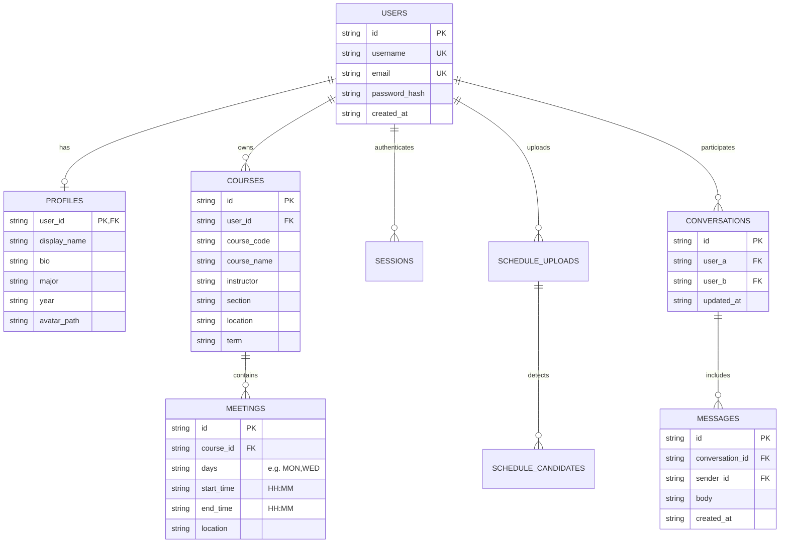

---

<a id="restful-api-reference"></a>
## 🔌 RESTful API Reference

| Area | Method | Path | Authentication | Description |
| :--- | :--- | :--- | :---: | :--- |
| **Auth** | `POST` | `/api/auth/register` | No | Register a user and create a session cookie |
| | `POST` | `/api/auth/login` | No | Log in with a username or email address and password |
| | `POST` | `/api/auth/logout` | No | Destroy the server-side session, if present, and clear the cookie |
| **Profile** | `GET` | `/api/me` | Yes | Get the current user's profile and courses |
| | `PATCH` | `/api/me` | Yes | Update display name, year, major, and bio |
| | `POST` | `/api/me/avatar` | Yes | Upload and store a profile image |
| | `GET` | `/api/users/:id` | Yes | Get a classmate's public profile and schedule overlap data |
| **Courses** | `GET` | `/api/courses` | Yes | Get the current user's courses and meetings |
| | `POST` | `/api/courses` | Yes | Add a course and its meeting times |
| | `PATCH` | `/api/courses/:id` | Yes | Update course information and replace its meeting list |
| | `DELETE` | `/api/courses/:id` | Yes | Delete a course and its associated meetings |
| **Discover** | `GET` | `/api/discover` | Yes | Find matching classmates; supports `sort`, `course`, `instructor`, `day`, and `time` query parameters |
| | `GET` | `/api/dashboard` | Yes | Get course and meeting counts, plus classmate counts for 3+ shared courses, 2+ shared courses, and any overlap |
| **Schedule** | `POST` | `/api/schedule/upload` | Yes | Upload a schedule image and extract course candidates with Tesseract OCR |
| | `POST` | `/api/schedule/confirm` | Yes | Save a batch of course candidates reviewed and confirmed by the user |
| **Messages** | `GET` | `/api/messages` | Yes | Get the conversation inbox, including message counts and latest messages |
| | `GET` | `/api/messages/:userId` | Yes | Get the complete message history with a specified user |
| | `POST` | `/api/messages` | Yes | Send a direct message with body `{ to, body }` |
| | `DELETE` | `/api/messages/:userId` | Yes | Delete the entire conversation with a specified user for both participants |

---

<a id="testing-and-automated-validation"></a>
## 🧪 Testing and Automated Validation

Tests cover the matching algorithms, RESTful APIs, and browser interactions:

```bash
# Run all 93 unit and integration tests
npm test

# Run algorithm and utility unit tests
npm run test:unit

# Run API and route integration tests with in-memory databases and temporary ports
npm run test:integration

# Run the complete 20-step Playwright browser flow
npm run test:e2e
```

### Sample Test Output

```text
✔ register creates user, profile and a session cookie (266ms)
✔ duplicate username or email is rejected (61ms)
✔ course overlap normalizes notation variants (1ms)
✔ instructor overlap handles variants and counts distinct persons (1ms)
✔ time overlap: exact, partial, none, different day (5ms)
✔ upload -> OCR candidates -> review -> confirm saves structured courses (380ms)
✔ real UCLA iCal calendar screenshot parses into plausible candidates (719ms)
✔ rankCandidates: best match combines dimensions; more shared courses wins (1ms)
✔ two users can exchange messages in both directions (107ms)
✔ DELETE removes the whole conversation for both users (94ms)
--------------------------------------------------------------------------------
ℹ tests 93  |  suites 0  |  pass 93  |  fail 0  |  cancelled 0  |  duration 1.59s
```

---

<a id="quick-start-and-local-setup"></a>
## 🚀 Quick Start and Local Setup

### Requirements

- **Node.js** ≥ 22.5.0, with the built-in `node:sqlite` module.
- **Tesseract OCR**, optional for local schedule recognition: `sudo apt install tesseract-ocr` or `brew install tesseract`.
- **Chromium**, optional for browser end-to-end tests: `npx playwright install chromium`.

### Install and Run in Three Steps

```bash
# 1. Clone the repository and install dependencies
git clone https://github.com/wjxssb/CS35.git
cd CS35
npm install

# 2. Build the frontend and populate the demo data
npm run build
npm run seed

# 3. Start the server
npm start
```

Open `http://localhost:3000` to use the application.

### Demo Accounts

`npm run seed` creates 10 UCLA student accounts across several majors, with schedules designed to demonstrate different kinds of overlap.<br/>
The initial password for every demo account is **`demo1234`**.

| Username | Display Name | Major | Example Courses and Matching Scenarios |
| :--- | :--- | :--- | :--- |
| **`frank`** | Frank Zhang | Computer Science | Main demo account: CS 35L, CS 111, and MATH 131A |
| **`dave`** | Dave Osei | Computer Science | **Three shared courses** with Frank: CS 35L, CS 111, and MATH 131A |
| **`carol`** | Carol Kim | Computer Science | **Two shared courses** with Frank: CS 35L and CS 111 |
| **`bob`** | Bob Martinez | Computer Science | **One shared course**: CS 35L, at the same time and location |
| **`ivy`** | Ivan Petrov | Electrical Eng | Five courses with multiple complete and partial time overlaps with Frank |
| **`henry`** | Henry Costa | Computer Science | Notation variant example: course code `COM SCI 35L` and instructor `Eggert, Paul` |
| **`erin`** | Erin Walsh | Electrical Eng | Same instructor, different course: CS 31 with Eggert |
| **`felix`** | Felix Braun | Chemistry | Different course, same afternoon and location as CS 35L |
| **`alice`** | Alice Nguyen | Art History | Cross-disciplinary example with no matching overlap |
| **`grace`** | Grace Adeyemi | Psychology | Psychology student for another cross-disciplinary example |

---

<div align="center">
  <sub>UCLA CS 35L Software Construction Project · Crafted with ❤️ by Frank & wjxssb</sub>
</div>
